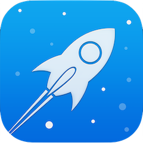

<!-- PROJECT SHIELDS -->
[![Xcode][xcode-shield]][xcode-url]
[![Swift][swift-shield]][swift-url]
[![MIT License][license-shield]][license-url]


<!-- PROJECT LOGO -->
<br />
<p align="center">
  <a href="https://github.com/DM1TRYM/SpaceGameTest">
    
  </a>

  <h3 align="center">Space War Game</h3>

  <p align="center">
    This is the source code for <i>Space War Game</i> - Simple game based on SpriteKit. Using Facebook SDK for Authentication and Deep Linking functional.
    <br />
    <a href="https://github.com/DM1TRYM/SpaceGameTest"><strong>Explore the docs »</strong></a>
    <br />
    <br />
    <a href="https://github.com/DM1TRYM/ScreenSpace.png">View Demo</a>
  </p>
</p>

<!-- TABLE OF CONTENTS -->
## Table of Contents

* [About the Project](#about-the-project)
  * [Built With](#built-with)
* [Getting Started](#getting-started)
  <!-- * [Prerequisites](#prerequisites) -->
  * [Installation](#installation)
<!-- * [Usage](#usage) -->
<!-- * [Roadmap](#roadmap) -->
* [License](#license)
* [Contact](#contact)
* [Acknowledgements](#acknowledgements)

<!-- ABOUT THE PROJECT -->
## About The Project

![Screenshot][product-screenshot]

### Built With

* [UIKit](https://developer.apple.com/documentation/uikit)
* [SpriteKit](https://developer.apple.com/documentation/spritekit)
* [FacebookSDK](https://github.com/facebook/facebook-ios-sdk)

<!-- GETTING STARTED -->
## Getting Started

To get a local copy up and running follow these steps.

### Prerequisites

This project uses Cocoapods to manage dependencies.

* If you haven't done so already, install Cocoapods:

  ``` bash
  sudo gem install cocoapods
  ```

### Installation

1. Clone the repo
2. Navigate to the project folder
3. Install dependencies
4. Open the project

``` bash
git clone https://github.com/DM1TRYM/SpaceGameTest.git
pod install
xed .
```

<!-- Demo -->
## Demo
![Demo][product-demo]

<!-- LICENSE -->
## License

See [LICENSE](LICENSE)

<!-- CONTACT -->
## Contact

Dmitry Mikhailov - [@mihadv](https://t.me/mihadv)


Project Link: [https://github.com/DM1TRYM/SpaceGameTest](https://github.com/DM1TRYM/SpaceGameTest)

<!-- ACKNOWLEDGEMENTS -->

## Acknowledgements

<!-- MARKDOWN LINKS & IMAGES -->
<!-- https://www.markdownguide.org/basic-syntax/#reference-style-links -->
[xcode-shield]: https://img.shields.io/badge/xcode-v12.0.1-blue
[xcode-url]: https://developer.apple.com/xcode/

[swift-shield]: https://img.shields.io/badge/swift-v5.3-%23fe4b2d
[swift-url]: https://swift.org/

[license-shield]: https://img.shields.io/github/license/DM1TRYM/ToDo-Firebase.svg?style%3Dflat-square
[license-url]: https://github.com/DM1TRYM/ToDo-Firebase/blob/main/LICENSE

[product-screenshot]: /ScreenSpace.png
[product-demo]: /SpaseWarGif.gif
